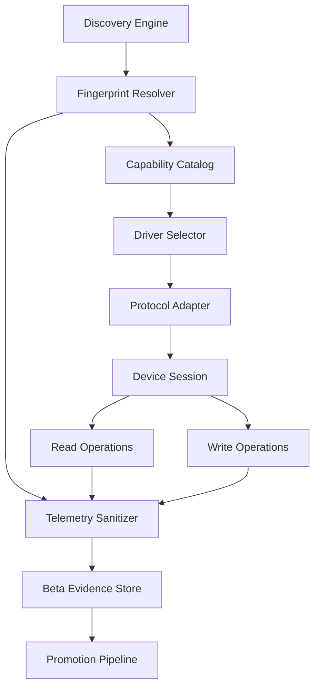
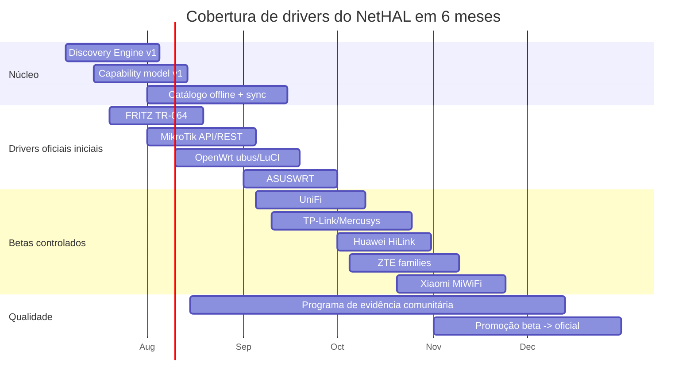

# NetHAL e absorção de drivers, APIs e repositórios para dispositivos de rede domésticos e CPEs de ISP

## Resumo executivo

A pesquisa indica que o caminho com melhor relação entre cobertura, risco e velocidade para o NetHAL é adotar uma arquitetura em camadas: primeiro um **Discovery Engine** baseado em heurísticas padronizadas e de baixo risco; depois **adaptadores de protocolo** para superfícies relativamente estáveis; por fim **drivers por fabricante/modelo/firmware** somente onde houver evidência prática suficiente. Em termos de retorno imediato, os maiores alvos para a Fase 1 são **TR-064/UPnP IGD para FRITZ!Box e alguns CPEs**, **LuCI/OpenWrt RPC**, **MikroTik RouterOS API/REST**, **ASUSWRT via HTTP(S)**, **UniFi local/official API**, e **famílias comunitárias com forte massa crítica** como TP-Link Archer/Mercusys, Huawei HiLink XML API, ZTE Web API e Xiaomi MiWiFi. TR-069/CWMP é importante para o ecossistema de ISP, mas é um protocolo **ACS↔CPE**, orientado a provisão remota do provedor, e não deve ser o primeiro alvo para automação local de usuário final. citeturn14view0turn18view0turn39search0turn39search1turn32view0turn12search0turn26view0turn27search8turn28search2turn29search2

Do ponto de vista de reuso, há material open source de alta qualidade para quase todos os blocos fundamentais. Para SOAP/TR-064, `fritzconnection` e `python-tr064` já resolvem descoberta de serviços, autenticação digest e invocação de actions. Para UPnP/IGD, `pupnp` e `miniupnp` cobrem discovery, SSDP e controle. Para HTTP/REST/JSON-RPC, `libcurl` e os clients especializados de RouterOS, AsusRouter e UniFi reduzem muito o esforço. Para SNMP, `net-snmp` continua sendo a base mais sólida. Para SSH, `paramiko` é a escolha prática em Python. O resultado é que o NetHAL não precisa “inventar” o stack de transporte; ele precisa sobretudo de um **modelo de capacidades**, um **catálogo offline de fingerprints** e um **pipeline disciplinado de promoção beta→oficial**. citeturn34view3turn34view4turn34view5turn38search0turn34view6turn35view0turn34view7turn34view2turn32view0turn40search2

A conclusão estratégica é clara: o NetHAL deve nascer como **produto separado e experimental**, com política explícita de consentimento, logs sanitizados e telemetria mínima, e só depois virar módulo do SignallQ. Misturar cedo drivers não homologados ao fluxo principal aumentaria custo de suporte, risco reputacional e superfície de segurança. Esse diagnóstico é coerente com a própria natureza das APIs pesquisadas: várias são **não documentadas, dependentes de firmware e sujeitas a regressões**, como mostram TP-Link, UniFi local versionada, Xiaomi MiWiFi, ZTE Web API e até stacks consagradas como LuCI RPC e integrações Home Assistant quebrando entre versões. citeturn26view0turn12search0turn12search22turn29search2turn28search2turn23search0turn11search15

## Protocolos, superfícies de controle e heurísticas de detecção

O quadro abaixo resume os protocolos e superfícies prioritários para o NetHAL. As colunas de “vantagem”, “limitação” e “risco” combinam documentação oficial com inferência operacional desta pesquisa.

| Protocolo / superfície | Capacidades típicas | Endpoints / padrões típicos | Autenticação comum | Vantagens | Limitações | Riscos principais | Heurísticas de detecção |
|---|---|---|---|---|---|---|---|
| **TR-064** | Status WAN, WLAN, hosts, reboot, configuração Wi‑Fi, DHCP, telefonia e serviços AVM/FRITZ | `GET /tr64desc.xml`; `POST /upnp/control/*`; SOAPAction como `DeviceInfo:1#GetSecurityPort` | HTTP Digest MD5; em FRITZ também “content-level auth” SOAP | Muito rico em FRITZ!; modelo estável e legível por descritores SCPD | Forte concentração em AVM e derivados; não é onipresente | Exposição indevida de funções administrativas se mal configurado; abuso de credenciais; mudanças por firmware | SSDP `ST: urn:dslforum-org:device:InternetGatewayDevice:1`; `LOCATION` apontando para `tr64desc.xml`; `SERVER: FRITZBOX UPnP/...`; `manufacturer=AVM` em XML citeturn14view0turn16view0turn18view0 |
| **TR-069 / CWMP** | Provisionamento remoto, firmware, parâmetros, monitoração e diagnósticos via ACS | Sessões SOAP sobre HTTP/HTTPS entre CPE e ACS; `Connection Request` do ACS ao CPE | HTTP/HTTPS, autenticação ACS↔CPE, mecanismos de connection request | Relevância enorme em CPE de ISP | Não é, em geral, uma API local amigável ao usuário; depende do ecossistema ACS | Alta sensibilidade operacional; risco de interferir em provisão do ISP | Indícios em dados do dispositivo: “TR-069 Provisioning Code”, ManagementServer, parâmetros CWMP; útil mais para fingerprint do que para ação local inicial citeturn19search0turn19search1turn14view0 |
| **UPnP IGD / SSDP / SOAP** | Descoberta, status WAN, external IP, port mapping, algumas métricas | UDP 1900 com `M-SEARCH`; descritor XML em `rootDesc.xml`, `igd.xml` ou similar; SOAP em `controlURL` | Frequentemente sem autenticação para leitura; escrita varia por implementação | Quase ubíquo em roteadores domésticos; ótimo para fingerprint inicial | Cobertura de features é irregular; muitas implementações expõem só IGD | Histórico amplo de falhas em UPnP/HNAP e manipulação de NAT | SSDP `239.255.255.250:1900`, headers `ST`,`USN`,`SERVER`,`LOCATION`; descritores com `InternetGatewayDevice` e serviços `WANIPConnection` / `WANPPPConnection` citeturn17view1turn14view0turn34view5turn38search0 |
| **SNMP** | Inventário, sysDescr/sysObjectID, interfaces, uptime, counters, tabelas de ARP/roteamento se expostas | UDP 161; OIDs padrão como `.1.3.6.1.2.1.1.1` (`sysDescr`), `.1.3.6.1.2.1.1.2` (`sysObjectID`) | v1/v2c community; v3 com auth/privacy | Excelente para inventário e counters; padronizado | Em casas, muitas vezes desativado; escrita é rara e desaconselhável | Comunidades fracas em v1/v2c; enumeração excessiva; vazamento de topologia | `sysDescr`, `sysObjectID`, `sysName`, `ifDescr`, `ifType` são sinais de fingerprint e capability mapping por vendor OID citeturn25search0turn25search2turn24search2 |
| **HTTP/REST** | Status, métricas, controle, configuração, CRUD | JSON sobre `https://<ip>/rest` em RouterOS; APIs locais específicas por fabricante | Basic, Digest, cookies, token, API key | Mais simples de integrar e instrumentar | Alta fragmentação entre vendors e firmwares | CSRF, session fixation, credenciais em claro se HTTP | Descobrir por headers, páginas de login, XHR/fetch, OpenAPI local, `Content-Type: application/json` citeturn39search0turn39search4turn32view0turn12search0 |
| **SOAP genérico / HNAP** | Administração, leitura e escrita de parâmetros, reboot, status | D‑Link tipicamente `/HNAP1/`; SOAPAction com ações como `GetDeviceSettings` | Variável; implementations históricas com falhas de auth | Modelos antigos expõem muita função | Superfície inconsistente e historicamente vulnerável | Auth bypass e command injection em HNAP são recorrentes | Detectar `POST /HNAP1/`, cabeçalho `SOAPAction`, respostas XML SOAP, referências a HNAP/HNAP1 na UI ou descritores citeturn31search0turn31search5turn31search7 |
| **JSON-RPC LuCI** | Login, UCI/config, status IP, consultas de subsistemas | `POST /cgi-bin/luci/rpc/auth` e namespaces como `/cgi-bin/luci/rpc/uci` | Cookie `sysauth` ou token RPC | Muito útil em OpenWrt/derivados; boa massa crítica | Depende de `luci-mod-rpc`; sem isso não existe | Bugs históricos de auth/session; superfície muito sensível | Tentar `POST /cgi-bin/luci/rpc/auth` com método `login`; presença de `Set-Cookie: sysauth=...` é forte indicador citeturn23search0turn23search1turn23search15 |
| **OpenWrt ubus / rpcd / uhttpd-mod-ubus** | Inventário, estado de interface, UCI, chamadas internas para serviços do sistema | `POST /ubus` em JSON-RPC; métodos tipo `session login`, `uci get`, `network.*` | Sessão `ubus_rpc_session`, ACLs rpcd, usuário local | Melhor superfície “nativa” para OpenWrt moderno | Requer packages/ACLs corretos; não é padrão fora de OpenWrt | ACL excessiva, execução indevida via rpcd/file hooks, bugs em LuCI-base | Detectar `/ubus`, objeto `session`, resposta JSON-RPC, presença de `rpcd`/`uhttpd-mod-ubus` e ACLs compatíveis citeturn21search25turn22search2turn22search9turn21search11 |
| **SSH** | Execução remota, leitura de arquivos, `uci`, `ubus`, `iwinfo`, `ip`, `logread` | TCP 22 | Senha, chave, keyboard-interactive | Universal, muito poderoso e robusto | Não há modelo uniforme entre vendors; parsing frágil | Escalada de dano se automação errar comando; segredos em shell history | Banner `SSH-2.0-*`, fingerprints de host key, combinação com `/etc/os-release`, `ubus list`, `uci show` quando autorizado citeturn3search1turn34view7 |
| **Telnet** | Leitura e execução rudimentar em firmwares antigos/legados | TCP 23 | Usuário/senha em claro | Útil em hardware legado quando não há alternativa | Obsoleto e inseguro | Credenciais em claro e grande superfície de abuso | Banner Telnet e prompts de login; usar apenas em modo “legacy-lab”, nunca oficial citeturn34view6turn9search0 |
| **mDNS / DNS-SD** | Descoberta amigável de hostname e serviços | UDP 5353; `_http._tcp`, `_ssh._tcp`, etc. | Sem auth | Útil para descobrir nomes e papéis | Nem sempre exposto em roteadores | Enumeração passiva de serviços | Anúncios mDNS, `hostname.local`, serviços HTTP/SSH/IPP | citeturn3search4turn3search6 |
| **CoAP** | Telemetria e configuração em IoT/edge específicos | UDP 5683 | DTLS ou sem auth, depende do device | Leve e bom para IoT | Pouco comum em roteadores domésticos clássicos | Implementações frágeis e heterogêneas | Respostas CoAP, recursos `/.well-known/core` | citeturn3search3 |
| **NETCONF** | Configuração declarativa e recuperação de estado | SSH/830, XML, `<hello>`/capabilities | SSH | Excelente quando existe | Muito raro em CPE doméstico; mais comum em enterprise/ISP | Mudanças transacionais ainda podem quebrar WAN | Banner NETCONF/SSH, porta 830, `<hello>` capabilities | citeturn3search2 |
| **OpenWrt LuCI UI / WebUI derivada** | Estado e ações via mesma superfície da interface web | Páginas LuCI, XHR, formulários UCI | Sessão Web e CSRF | Útil para fallback e reverse engineering | Frágil a mudanças de frontend | Mudanças a cada release e risco de scraping frágil | HTML com referências LuCI, `cgi-bin/luci`, JS `LuCI.rpc` | citeturn34view1turn22search11 |

Há quatro implicações práticas para o Discovery Engine. Primeiro, **SSDP/UPnP** e **HTTP GET passivo** devem vir antes de qualquer login, porque identificam fabricante, modelo e descritores com baixo risco operacional. Segundo, **TR-064** faz sentido como família própria, não só como subcaso de SOAP, porque a árvore de serviços e a autenticação AVM têm comportamento distintivo e muito bem documentado. Terceiro, **OpenWrt** merece dois adaptadores separados: um para **LuCI JSON-RPC legado** e outro para **ubus/rpcd**. Quarto, **TR-069** deve entrar no fingerprinting e na telemetria, mas não como driver de ação local na Fase 1. citeturn17view1turn18view0turn23search0turn22search2turn19search1

## Reuso de projetos open source e SDKs

O reuso ideal para o NetHAL não é “um SDK para mandar em todos os roteadores”; é um **portfólio de blocos especializados**. O núcleo deve ficar responsável por descoberta, normalização, capability model, retries, timeouts, sanitização e scoring. As bibliotecas externas devem ser encaixadas nos adaptadores onde já têm maturidade clara. citeturn34view3turn34view4turn34view5turn34view6turn35view0turn34view7

No eixo **TR-064 / FRITZ!Box**, `fritzconnection` é a melhor base Python para produção porque já cobre TR-064 e a AHA HTTP Interface, tem documentação própria e sinais de maturidade de pacote “Production/Stable” no setup. `python-tr064` é excelente como cliente leve e genérico para um adaptador de protocolo mais fino. `FritzBox-API` e variantes em Node/Go são úteis como referência secundária, mas eu os trataria como suporte de pesquisa, não como base padrão do produto. citeturn36search6turn34view3turn34view4turn35view5turn33search3turn33search20

No eixo **UPnP / SSDP / SOAP**, `pupnp` e `miniupnp` são peças maduras e de baixo risco de licença, ambas sob BSD-3-Clause. `pupnp` é melhor como SDK C para construir discovery/control points completos; `miniupnp` é particularmente útil para IGD/NAT traversal e testes de port mapping. `gSOAP` é tecnicamente forte para ambientes C/C++, mas o cenário de licenciamento é menos amigável: a edição open source é GPLv2 e há oferta comercial separada, então ela não é uma escolha neutra se o NetHAL quiser maximizar flexibilidade futura de distribuição. citeturn34view5turn38search2turn38search0turn35view1turn5search17

No eixo **HTTP/REST/JSON-RPC**, a base universal deveria ser `libcurl` para componentes nativos e `requests`/`aiohttp` em Python. A vantagem de `libcurl` é cobrir HTTP, HTTPS e até TELNET, SCP e outras variantes usadas em ambientes heterogêneos, com licença permissiva. Para SSH, `paramiko` continua a opção pragmática. Para SNMP, `net-snmp` é o principal toolkit reutilizável. citeturn34view6turn34view7turn35view0

No eixo **OpenWrt**, as peças centrais não são só o firmware em si, mas o trio **LuCI + rpcd + ubus**, com `uhttpd-mod-ubus` expondo proxy HTTP/JSON-RPC. Como muitos CPEs de OEM ou firmwares customizados derivam de OpenWrt/LEDE, esse cluster tem valor de cobertura acima do que a marca “OpenWrt” sugere. A própria documentação do LuCI recomenda `ucode` e `rpcd` para operações server-side, o que reforça esse ponto de integração. citeturn34view1turn21search11turn21search25turn37search6

No eixo **MikroTik**, vale separar dois caminhos. Para **RouterOS API** tradicional, `socialwifi/RouterOS-api`, `LaiArturs/RouterOS_API` e `librouteros` já resolvem muito bem a comunicação estilo CLI/API; `socialwifi` é o reuso mais simples e permissivo para Python. Para **RouterOS REST API v7**, `rosrestpy` é alinhado ao documento oficial, mas menos maduro que os clientes da API clássica. Como MikroTik mantém documentação oficial tanto da API quanto do REST, esta é uma das famílias mais promissoras para promoção rápida a “driver oficial”. citeturn39search1turn39search0turn34view2turn35view2turn35view3turn35view4

No eixo **fabricantes com APIs web não documentadas**, os melhores reaproveitamentos são os integradores comunitários: `AsusRouter`, `TP-Link-Archer-C6U`, `huawei-router-api`, `zte_tracker`, `pymiwifi`, `Art-of-WiFi` e `ubiquiti-community/unifi-api`. O padrão se repete: usar esses projetos como **referência funcional, fonte de endpoints, fluxos de autenticação e contratos de dados**, mas manter no NetHAL uma camada unificadora própria para reduzir lock-in a escolhas de linguagem, licenças ou convenções de cada projeto. citeturn32view0turn26view0turn26view2turn26view3turn29search2turn40search2turn40search1

### Tabela de repositórios e bibliotecas recomendados

Na coluna “maturidade”, usei **avaliação desta pesquisa** com base em sinais públicos visíveis: documentação, releases, tempo de vida, evidência de adoção, activity e estabilidade do escopo. O esforço de integração também é avaliação desta pesquisa.

| Nome | URL | Licença | Linguagem | Maturidade | Papel recomendado | Esforço de integração |
|---|---|---:|---|---|---|---|
| OpenWrt | `https://github.com/openwrt/openwrt` | GPL-2.0-only | C / build system | Alta | Catálogo de fingerprints, referência de subsistemas, base para driver OpenWrt | Médio |
| LuCI | `https://github.com/openwrt/luci` | Apache-2.0 | Lua / JS / ucode | Alta | Adaptador LuCI RPC, fingerprinting, fallback WebUI | Médio |
| fritzconnection | `https://github.com/kbr/fritzconnection` | MIT | Python | Alta | Driver FRITZ!Box / TR-064 / AHA HTTP | Baixo |
| python-tr064 | `https://github.com/bfueldner/tr064` | MIT | Python | Alta | Adaptador genérico TR-064 | Baixo |
| pupnp | `https://github.com/pupnp/pupnp` | BSD-3-Clause | C | Alta | Discovery SSDP/UPnP e control point | Médio |
| miniupnp | `https://github.com/miniupnp/miniupnp` | BSD-3-Clause | C | Alta | IGD/NAT traversal, testes e probes de IGD | Baixo |
| curl / libcurl | `https://github.com/curl/curl` | MIT-like | C | Muito alta | Transporte HTTP/HTTPS/TELNET/SCP em componentes nativos | Baixo |
| net-snmp | `https://github.com/net-snmp/net-snmp` | Ver COPYING do projeto | C | Alta | Adaptador SNMP e fingerprint por OID | Médio |
| Paramiko | `https://github.com/paramiko/paramiko` | LGPL-2.1 | Python | Alta | Adaptador SSH | Baixo |
| RouterOS-api | `https://github.com/socialwifi/RouterOS-api` | MIT | Python | Alta | Driver MikroTik API clássica | Baixo |
| RouterOS_API | `https://github.com/LaiArturs/RouterOS_API` | MIT | Python | Média | Driver MikroTik alternativo / fallback | Baixo |
| librouteros | `https://github.com/luqasz/librouteros` | GPL-2.0 | Python | Média | Driver MikroTik alternativo mais profundo | Médio |
| rosrestpy | `https://github.com/hexatester/rosrestpy` | ver repositório | Python | Média | Adaptador RouterOS REST v7 | Médio |
| AsusRouter | `https://github.com/Vaskivskyi/asusrouter` | Apache-2.0 | Python | Alta | Driver ASUSWRT / AsusWRT-Merlin | Baixo |
| TP-Link-Archer-C6U | `https://github.com/AlexandrErohin/TP-Link-Archer-C6U` | GPL-3.0 | Python | Média | Driver TP-Link/Mercusys e catálogo de modelos | Médio |
| home-assistant-tplink-router | `https://github.com/AlexandrErohin/home-assistant-tplink-router` | ver repositório | Python | Média | Fonte de capability mapping e edge-cases TP-Link | Médio |
| huawei-router-api | `https://github.com/siphomateke/huawei-router-api` | ver repositório | JavaScript | Média | Driver Huawei HiLink / referência de endpoints | Médio |
| zte_tracker | `https://github.com/juacas/zte_tracker` | GNU License | Python | Média | Driver ZTE / catálogo de modelos / reverse engineering guiado | Médio |
| zte-modem-api-docs | `https://github.com/wijayamin/zte-modem-api-docs` | Apache-2.0 | Docs / examples | Média | Documentação reversa e fingerprinting ZTE | Baixo |
| pyMiWiFi | `https://github.com/scientifichackers/pymiwifi` | MIT | Python | Média | Driver Xiaomi MiWiFi | Médio |
| UniFi Network Application API client | `https://github.com/Art-of-WiFi/unifi-network-application-api-client` | MIT | PHP | Média | Referência para driver UniFi official/local | Médio |
| UniFi OpenAPI Definition | `https://github.com/ubiquiti-community/unifi-api` | MPL-2.0 | OpenAPI / Go tooling | Média | Capability mapping e geração de cliente para UniFi | Médio |
| FritzBox-API | `https://github.com/ISchwarz23/FritzBox-API` | ver repositório | Java | Baixa | Referência secundária para FRITZ WebApp | Alto |

Fontes da tabela: OpenWrt/LuCI/MikroTik/FRITZ/UPnP/curl/Paramiko e pages dos repositórios consultados. citeturn37search6turn34view1turn36search6turn34view4turn34view5turn38search0turn34view6turn35view0turn34view7turn34view2turn35view2turn35view3turn35view4turn32view0turn26view0turn26view2turn26view3turn28search2turn29search2turn40search2turn40search1turn35view5

## Fabricantes e ecossistemas existentes de drivers e catálogos

### Fabricantes e APIs por prioridade prática

**AVM / FRITZ!Box** é o caso mais favorável do mercado doméstico europeu. A AVM mantém uma página oficial de interfaces com documentação viva para TR-064, Session ID, Smart Home REST API, AHA HTTP Interface e JSON de topologia mesh. A documentação mostra serviços amplos para WAN, WLAN, hosts, storage, telephony e até TR-069/USP controller, além de exemplos concretos com `GET /tr64desc.xml`, `POST /upnp/control/deviceinfo` e a action `GetSecurityPort`. Essa combinação faz da AVM o melhor primeiro “driver oficial” do NetHAL fora do mundo GPON. citeturn14view0turn18view0

**MikroTik** também é candidato forte. A documentação oficial cobre tanto a **API clássica** quanto a **REST API**. A REST é descrita formalmente como um wrapper JSON da console API e fica sob `/rest` quando o serviço web está habilitado. A API clássica segue a sintaxe da CLI e é apropriada para leitura e escrita de configuração. Isso reduz incerteza documental e facilita construir um capability model confiável. citeturn39search0turn39search1turn39search4

**Ubiquiti / UniFi** melhorou muito de perspectiva. Hoje há documentação oficial para a **Official UniFi API**, e a própria Ubiquiti informa que a documentação localizada da Network API fica em **UniFi Network > Integrations**. Para deploys locais, a comunidade documentou bem as diferenças entre controladores tradicionais e UniFi OS, com login em `/api/auth/login` e prefixo `/proxy/network/...` nos consoles UniFi OS; além disso, já há uma especificação OpenAPI comunitária apontando para `.../proxy/network/api-docs/integration.json`. O cuidado aqui é que a superfície local continua **versionada por produto e versão do Network Application**, então o NetHAL deve tratar UniFi como “documentado, porém mutável”. citeturn12search0turn12search4turn12search8turn40search1turn40search2

**ASUS / ASUSWRT** tem bom ecossistema comunitário. A biblioteca AsusRouter afirma explicitamente que usa a mesma API HTTP(S) da WebUI, compatível com AsusWRT stock e AsusWRT-Merlin, e o próprio projeto/guia recomenda HTTPS com configuração local do método de autenticação e porta padrão 8443. É uma família muito atraente para o NetHAL porque o ecossistema Home Assistant já expõe bastante do que vale monitorar e controlar. O principal cuidado é a variabilidade entre linhas e firmwares, com exceções documentadas como Merlin `388.10`. citeturn32view0turn32view2turn11search1turn11search5

**TP-Link / Mercusys** é valioso, mas precisa entrar como **beta forte**, não como oficial imediato. Os projetos comunitários mostram boa cobertura de modelos Archer e Mercusys, suporte a HTTP e HTTPS, usernames variáveis (`admin` ou `user`), necessidade de “Local Password” em vez de TP-Link ID e, em alguns firmwares, o uso de “web encrypted password” extraída do DOM da página de login. O próprio maintainer avisa que updates de firmware quebram compatibilidade. Isso é excelente para um programa beta com telemetria e fingerprint por firmware; é ruim para prometer estabilidade cedo demais. citeturn26view0turn26view1turn39search2turn39search9

**Huawei HiLink** tem padrão prático bem reconhecível na comunidade: `GET /api/webserver/SesTokInfo` para obter `SesInfo` e `TokInfo`, seguido de chamadas XML/HTTP como `/api/device/information` com header `__RequestVerificationToken` e cookie de sessão. Há forte ecossistema reverso e até o Home Assistant já sofreu issues nessa base. O ponto forte é disponibilidade de endpoints comunitariamente conhecidos; o ponto fraco é a ausência, nesta pesquisa, de documentação pública oficial abrangente equivalente à da AVM ou MikroTik. citeturn27search0turn27search2turn27search5turn27search8

**ZTE** também apresenta um padrão plausível, mas com mais diversidade de firmwares. Duas superfícies apareceram com força: o par `/goform/goform_get_cmd_process` e `/goform/goform_set_cmd_process`, comum em modems/routers LTE, e endpoints em `.lua` ou parâmetros `_type/_tag`, como `?_type=menuData&_tag=wlan_client_stat_lua.lua`, encontrados em integrações e material de reverse engineering. Isso sugere que o NetHAL deve tratar ZTE por **família de frontend/firmware**, não só por marca. citeturn28search1turn28search2turn27search1turn28search4

**Xiaomi MiWiFi** é útil, mas arriscado como primeira vitrine. Há evidências consistentes de endpoints como `/cgi-bin/luci/api/xqsystem/login`, uso de `;stok=` na URL, e chamadas como `/api/misystem/devicelist`, `/api/xqnetwork/wifi_detail_all` e vários endpoints `xqsystem`/`misystem`. O problema é que o ecossistema público disponível também é cheio de material de exploração e mudanças não documentadas por firmware, o que força o NetHAL a impor uma linha dura: só leitura inicialmente, e escrita apenas em modelos já validados. citeturn29search2turn29search5turn30search10turn30search2

**D-Link** deve entrar pela via de **fingerprinting e leitura limitada**, não por controle ativo, porque a superfície HNAP/HNAP1 tem histórico longo de auth bypass e command injection. O endpoint `/HNAP1/` e SOAPActions como `GetDeviceSettings` aparecem recorrentemente em advisories oficiais e bases de vulnerabilidade. Aqui, a função do NetHAL deve ser identificar, alertar e recusar ações destrutivas por padrão, salvo homologação muito específica. citeturn31search0turn31search5turn31search7turn31search10

**Intelbras** aparece menos por API documentada e mais por indícios genéricos: manuais mostram gestão via web/app e produtos como o ACtion RG 1200 expõem UPnP; além disso, há pesquisa recente reportando `rootDesc.xml` em porta 5500 com MiniUPnPd sem autenticação em LAN. Na prática, isso coloca Intelbras como alvo interessante via **UPnP/IGD genérico** e, secundariamente, por reverse engineering controlado de WebUI. Eu não colocaria Intelbras como driver específico de Fase 1, mas sim como subproduto do esforço de UPnP e de OEM/OpenWrt-like fingerprinting. citeturn13search5turn13search1turn13search4

### Ecossistemas existentes para fingerprinting e capability mapping

O **Home Assistant** é uma fonte muito valiosa de “catálogo vivo de capabilities”. As integrações oficiais de **FRITZ!Box Tools**, **ASUSWRT**, **Mikrotik** e **UPnP/IGD** mostram quais entidades e operações são estáveis o bastante para usuários finais. Já as integrações comunitárias de TP-Link, Xiaomi, ZTE e AsusRouter ampliam cobertura e, principalmente, expõem os edge-cases de autenticação, polling e compatibilidade por firmware. Para o NetHAL, a recomendação é usar esse ecossistema como **oráculo de mapeamento de capacidade**, não como dependência de runtime. citeturn11search0turn11search1turn11search2turn11search3turn26view1turn32view2turn26view3turn29search2

O **Nmap** é a melhor base pública para fingerprinting de rede genérico. A documentação oficial explica tanto o formato de fingerprints de OS quanto o `nmap-service-probes` usado para service/version detection. Para o NetHAL, isso é útil em dois níveis: primeiro, para reconhecer banners e respostas típicas em HTTP/SSH/Telnet; segundo, para criar um pipeline interno de “fingerprint string → vendor/model guess → confidence score”. O NetHAL não precisa reimplementar Nmap, mas deve **absorver a lógica de probe/result normalization**. citeturn10search1turn10search5turn10search9turn10search13

Já fontes “DeviceAtlas-like” fazem sentido apenas como inspiração de **estrutura de catálogo offline**, porque sua proposta é identificação de dispositivos por headers e bases de dados JSON atualizadas diariamente. Isso combina bem com a ideia de sincronizar um **catálogo offline de heurísticas e capabilities** no NetHAL. Mas tais fontes não resolvem, por si, a parte difícil aqui: mapear **ações locais por router firmware**. Servem para enriquecer taxonomia e atualização incremental. citeturn10search3turn10search7turn10search11turn10search19

Sobre “RouterDB”, esta pesquisa não encontrou uma fonte primária ou catálogo confiável com esse nome focado em fingerprinting de CPE doméstico; os resultados relevantes encontrados foram **não relacionados** a esse problema, como a estrutura `RouterDb` do Itinero e o arquivo `router.db` do RANCID. Por isso, eu **não recomendaria RouterDB como base primária** para o NetHAL sem uma fonte mais específica e verificável. citeturn10search2turn10search10

## Segurança, privacidade e aspectos operacionais

O risco técnico dominante não é “falhar em descobrir o roteador”; é **executar ações num driver errado**. As fontes mostram numerosos exemplos de superfícies frágeis ou historicamente vulneráveis: HNAP em D-Link, UPnP sem autenticação em produtos domésticos, RPC/LuCI envolvido em casos de segurança e WebUIs que mudam arbitrariamente com firmware. Esse contexto exige que o NetHAL trate descoberta e ação como coisas diferentes. A descoberta pode ser relativamente ampla; a ação deve ser opt-in, capability-gated e baseada em alta confiança. citeturn31search0turn31search5turn13search1turn21search8turn23search3

Há também risco de **interferência operacional** com o próprio usuário ou com o provedor. Em TP-Link, por exemplo, a integração comunitária alerta que a interface web só suporta um usuário logado por vez e que a automação pode desconectar sessões da UI. Em FRITZ!Box, a documentação separa leitura, autenticação digest e content-level auth com cautelas próprias, e o próprio dispositivo pode responder `503` em vez de `401` quando há excesso de requests não autenticados. Em TR-069, qualquer ação fora de contrato local pode colidir com a provisão do ACS do ISP. citeturn26view1turn17view3turn19search1

A política recomendada para o NetHAL é:

1. **Descoberta passiva antes de qualquer credencial**. SSDP, HEAD/GET em paths seguros, banners e OIDs básicos primeiro.  
2. **Consentimento explícito por escopo**. Um consentimento para “ler status”, outro para “alterar configuração” e outro, separado, para “reiniciar o equipamento”.  
3. **Nunca tentar autenticação automática cega em massa**. No máximo, o usuário escolhe o fabricante e fornece uma credencial de laboratório.  
4. **Sem escrita por default em adaptadores beta**. Em beta, apenas leitura, salvo whitelist por modelo/firmware.  
5. **Recusa ativa para superfícies historicamente perigosas**. Ex.: HNAP D-Link e rotas conhecidas de exploração Xiaomi só podem ser usadas para fingerprinting defensivo, nunca para automação padrão. citeturn31search7turn30search5turn13search1

Para telemetria, a regra deve ser **sanitização agressiva**. Recomendo armazenar somente: fabricante inferido, modelo inferido, firmware, hash do gateway, classes de endpoints encontrados, resultado de probes, status code, presença/ausência de campos e hashes de resposta estruturada quando necessário. Não armazenar SSID em claro, senha, cookies, tokens, IP público, serial number integral, lista completa de clientes ou dumps de HTML/XML crus por padrão. Quando o diagnóstico exigir payload exemplificativo, o produto deve usar **redaction determinística** antes do upload. Essa parte é proposta arquitetural desta pesquisa.

Também vale separar **uso próprio e autorizado** de qualquer noção de “varredura”. O produto deve operar apenas na **LAN do usuário**, sobre o **gateway explicitamente escolhido**, e com UI textual clara dizendo que drivers experimentais podem falhar e que ações administrativas podem afetar conectividade. Isso não substitui parecer jurídico local, mas reduz bastante risco de abuso e alinhamento indevido com termos de uso de provedores e fabricantes. A própria AVM deixa claro que pode alterar ou remover funções/documentação sem aviso e impõe cautelas de marca/trademark em apps de terceiros, o que reforça a necessidade de isolamento do NetHAL como produto separado e experimental. citeturn14view0

## Arquitetura recomendada para adaptadores e drivers do NetHAL

O NetHAL deve ter quatro planos: **discovery**, **fingerprinting**, **capability resolution** e **driver execution**.



### Interface sugerida para adaptadores

Uma interface mínima para cada adaptador/driver deveria expor:

```text
probe(host, port_hint?) -> ProbeResult[]
fingerprint(probes, html?, xml?, headers?, banners?) -> FingerprintResult
authenticate(credentials, mode) -> SessionHandle
list_capabilities(session) -> CapabilitySet
read(capability, params?) -> NormalizedState
write(capability, params) -> ActionResult
healthcheck(session) -> DriverHealth
sanitize(raw) -> SanitizedEvidence
```

O `CapabilitySet` não deve depender do fabricante; ele deve ser normalizado em verbos e objetos, por exemplo:

- `wan.status.read`
- `wan.ip.read`
- `wifi.ssid.read`
- `wifi.ssid.write`
- `wifi.password.write`
- `wifi.channel.read`
- `wifi.channel.write`
- `clients.list.read`
- `system.reboot.write`
- `firmware.version.read`
- `mesh.topology.read`

Essa camada é o que permitirá ao SignallQ, no futuro, usar “módulos” do NetHAL sem conhecer detalhes de cada marca.

### Scoring de confiança

Sugestão de score de confiança de 0 a 1:

- **0,25**: match de cabeçalhos/banners (`SERVER`, `WWW-Authenticate`, HTML title, marca em XML)
- **0,20**: match de descritor ou endpoint canônico (`/tr64desc.xml`, `/ubus`, `/rest`, `/api/webserver/SesTokInfo`)
- **0,20**: autenticação bem-sucedida em modo esperado
- **0,15**: capability sanity check coerente
- **0,10**: firmware/modelo presente no catálogo offline
- **0,10**: evidência comunitária / histórico local bem-sucedido

Regras práticas:
- **< 0,50**: somente leitura passiva, sem autenticação adicional
- **0,50–0,75**: leitura autenticada permitida
- **0,75–0,90**: escrita não destrutiva permitida
- **> 0,90**: reboot e mudanças sensíveis somente com consentimento explícito

### Telemetria mínima recomendada

Campos sugeridos:

- `gateway_hash`
- `local_vendor_guess`
- `local_model_guess`
- `firmware_string`
- `protocol_family_detected[]`
- `auth_mode_used`
- `probe_paths_hit[]`
- `status_codes[]`
- `soap_actions_seen[]`
- `snmp_oids_seen[]`
- `capabilities_resolved[]`
- `driver_name`
- `driver_version`
- `confidence_score`
- `write_attempted`
- `write_success`
- `sanitized_error_class`

### Catálogo offline e sincronização

O catálogo offline deve conter:

- Assinaturas por **marca/modelo/firmware**
- Endpoints conhecidos
- Regras de autenticação
- Capabilities suportadas
- Bugs conhecidos e “firmware breaks”
- Política de risco por driver
- Links de documentação e repositórios de suporte
- Sample fingerprints sanitizados

A sincronização ideal é por manifesto versionado, por exemplo `catalog-2026.07.05.json`, com diff incremental. O cliente baixa só blocos relevantes por família.

### Critérios de promoção beta para oficial

Proposta de critérios:

- mínimo de **3 modelos físicos** ou **2 famílias de firmware** testadas
- pelo menos **500 sessões de leitura** com taxa de sucesso `>= 99%`
- pelo menos **100 ações de escrita não destrutiva** com taxa de sucesso `>= 98%`
- zero incidentes críticos de lockout, perda de sessão persistente ou degradação de WAN
- documentação de autenticação e rollback
- pelo menos um maintainer técnico responsável pelo driver
- evidência comunitária externa ou laboratório próprio reprodutível

Esses critérios são deliberadamente mais rígidos para escrita do que para leitura.

## Priorização, alvos da Fase 1 e roadmap

### Matriz de priorização

Abaixo, “valor” significa cobertura + estabilidade + utilidade; “dificuldade” significa esforço técnico; “risco” significa chance de suporte ruim, regressão por firmware ou exposição de segurança.

| Alvo | Valor | Dificuldade | Risco | Leitura desta pesquisa |
|---|---:|---:|---:|---|
| FRITZ!Box TR-064 | Muito alto | Baixa | Baixo | Melhor primeiro driver oficial fora GPON citeturn14view0turn18view0turn34view3 |
| OpenWrt ubus/rpcd | Muito alto | Média | Médio | Excelente para cobertura de OEM/OpenWrt-like citeturn21search11turn21search25turn22search2 |
| OpenWrt LuCI JSON-RPC | Alto | Média | Médio | Útil como legado/fallback, mas mais frágil que ubus citeturn23search0turn23search15 |
| MikroTik RouterOS API | Muito alto | Baixa | Baixo | Documentado e com bons clients citeturn39search1turn34view2 |
| MikroTik RouterOS REST | Alto | Média | Baixo | Ótimo para v7+, bom candidato a oficial cedo citeturn39search0turn39search4 |
| ASUSWRT | Alto | Baixa | Médio | Forte ecossistema comunitário e bom retorno citeturn32view0turn32view2 |
| UniFi official/local API | Alto | Média | Médio | Muito promissor, mas versionado por plataforma citeturn12search0turn12search8turn40search2 |
| UPnP/IGD genérico | Alto | Baixa | Médio | Excelente discovery, baixa garantia de escrita segura citeturn11search3turn38search0 |
| TP-Link/Mercusys | Alto | Média | Alto | Alto valor, mas firmware quebra integração citeturn26view0turn26view1 |
| Huawei HiLink XML API | Médio-alto | Média | Médio | Boa padronização comunitária citeturn27search8turn27search5 |
| ZTE Web API | Médio-alto | Média | Alto | Vale por famílias de firmware, não por marca genérica citeturn28search2turn28search4 |
| Xiaomi MiWiFi | Médio | Média | Alto | Bom para labs, menos bom para produção cedo citeturn29search2turn30search10 |
| D-Link HNAP | Médio | Média | Muito alto | Tratar como fingerprint/alerta, não como foco de ação citeturn31search7turn31search5 |
| TR-069 awareness | Médio | Alta | Alto | Importante para inventário, fraco como ação local inicial citeturn19search1 |
| SNMP generic | Médio | Baixa | Baixo | Bom complemento universal para leitura e inventário citeturn25search0turn25search2 |

### Primeiros 12 alvos para a Fase 1

Minha recomendação para os **12 primeiros drivers/protocolos** é:

1. **FRITZ!Box TR-064**  
2. **UPnP/IGD genérico**  
3. **OpenWrt ubus/rpcd**  
4. **OpenWrt LuCI JSON-RPC**  
5. **MikroTik RouterOS API**  
6. **MikroTik RouterOS REST**  
7. **ASUSWRT / AsusWRT-Merlin**  
8. **UniFi local / official Network API**  
9. **TP-Link Archer/Mercusys**  
10. **Huawei HiLink XML API**  
11. **ZTE Web API families**  
12. **Xiaomi MiWiFi**

A justificativa é simples. Os oito primeiros combinam melhor documentação, melhor massa crítica ou melhor estabilidade relativa. Os quatro seguintes têm grande valor de mercado e aprendizado, mas pedem regime beta desde o início. D-Link, Intelbras específico, CoAP, NETCONF e TR-069 awareness ficam como backlog de Fase 2, com D-Link preferencialmente no eixo de detecção defensiva. citeturn14view0turn11search3turn22search2turn23search0turn39search1turn39search0turn32view0turn12search0turn26view0turn27search8turn28search2turn29search2turn31search7

### Checklist conciso de probes para o Discovery Engine

- **SSDP / UPnP**
  - Enviar `M-SEARCH` para `239.255.255.250:1900`
  - Procurar `ST: urn:dslforum-org:device:InternetGatewayDevice:1`
  - Capturar `SERVER`, `LOCATION`, `USN` e `CACHE-CONTROL` citeturn17view1

- **TR-064 / FRITZ**
  - `GET /tr64desc.xml`
  - Se presente, ler `manufacturer`, `modelName`, `controlURL`
  - Testar SOAP `DeviceInfo:1#GetSecurityPort`
  - Verificar portas seguras retornadas, como `49443` nos exemplos AVM citeturn18view0

- **UPnP IGD**
  - `GET /rootDesc.xml`, `GET /igd.xml`
  - Enumerar `WANIPConnection`, `WANPPPConnection`, `WANCommonInterfaceConfig` citeturn14view0turn38search0

- **OpenWrt LuCI**
  - `POST /cgi-bin/luci/rpc/auth` com JSON-RPC `login`
  - Observar `Set-Cookie: sysauth=...`
  - Se houver, testar namespace seguro de leitura como `uci`/status citeturn23search0

- **OpenWrt ubus**
  - `POST /ubus`
  - Tentar `session login` e `session list`
  - Verificar se o proxy HTTP/JSON-RPC do `uhttpd-mod-ubus` está ativo citeturn22search2turn21search25turn22search9

- **MikroTik**
  - `GET /rest` ou `POST https://<ip>/rest/...` se o serviço web estiver habilitado
  - Se usar API clássica, tentar handshake do protocolo RouterOS API conforme docs oficiais / client escolhido citeturn39search0turn39search1

- **Huawei**
  - `GET /api/webserver/SesTokInfo`
  - Se houver `SesInfo` e `TokInfo`, testar `GET /api/device/information` com token/header apropriado citeturn27search5turn27search8

- **ZTE**
  - `GET /goform/goform_get_cmd_process?cmd=wa_inner_version,cr_version,RD&multi_data=1`
  - Tentar também padrões `?_type=menuData&_tag=wlan_client_stat_lua.lua`
  - Observar se respostas vêm em JSON ou XML citeturn28search1turn27search1

- **Xiaomi**
  - `POST /cgi-bin/luci/api/xqsystem/login`
  - Depois, se houver token `stok`, consultar `/cgi-bin/luci/;stok=<...>/api/misystem/devicelist` e `/api/xqnetwork/wifi_detail_all` citeturn30search10turn29search5

- **Ubiquiti**
  - `POST /api/auth/login`
  - Em UniFi OS, consultar `/proxy/network/api/...`
  - Se disponível, usar `/proxy/network/api-docs/integration.json` para mapear capabilities documentadas localmente citeturn12search8turn40search1

- **D-Link**
  - `POST /HNAP1/`
  - Ler comportamento ao header `SOAPAction`
  - Nunca automatizar escrita sem homologação específica citeturn31search0turn31search7

- **SNMP**
  - Ler `.1.3.6.1.2.1.1.1` (`sysDescr`)
  - Ler `.1.3.6.1.2.1.1.2` (`sysObjectID`)
  - Ler `.1.3.6.1.2.1.1.5` (`sysName`)
  - Opcional: `ifDescr`, `ifType`, `ifPhysAddress` para modelo/interface mapping citeturn25search0turn25search2

- **SSH / Telnet**
  - Capturar banner apenas
  - Em SSH, nunca tentar comando sem consentimento
  - Em Telnet, travar adaptador em “legacy-lab only” citeturn34view7turn9search0turn34view6

### Roadmap sugerido de 6 meses



### Próximos passos sugeridos

No curto prazo, eu faria cinco movimentos em paralelo. Primeiro, implementaria o **Discovery Engine passivo** com SSDP, GETs seguros, banners, SNMP básico e heurísticas HTML/XML. Segundo, subiria os três blocos mais valiosos: **FRITZ TR-064**, **MikroTik API/REST** e **OpenWrt ubus/LuCI**. Terceiro, publicaria um **schema público de telemetry sanitizada** para contribuições comunitárias. Quarto, criaria um **programa de beta adapters** por modelo/firmware para TP-Link, Huawei, ZTE e Xiaomi. Quinto, trataria Home Assistant e Nmap como fontes permanentes de atualização para capability mapping e fingerprint heuristics, e não apenas como referências pontuais. citeturn11search0turn11search1turn11search2turn10search1turn10search5turn26view0turn27search8turn28search2turn29search2

Entre as contribuições comunitárias mais úteis para cobrir os próximos seis meses estariam: envio de fingerprints sanitizados por **marca/modelo/firmware**, dumps redigidos de descritores XML e responses JSON, listas de capabilities testadas manualmente, relatórios de regressão por firmware e mapeamentos de UI→endpoint descobertos por DevTools. O projeto ZTE Tracker já explicita um fluxo pragmático de reverse engineering da web console que pode servir de modelo operacional para um “NetHAL Community Capture Kit”. citeturn27search1

Em síntese: dá para transformar o NetHAL em um produto sério, técnico e incrementalmente incorporável ao SignallQ. Mas isso depende de tratar **drivers como evidência**, não como desejo. O que esta pesquisa mostra é que já existe base documental e open source suficiente para começar forte — desde que o produto respeite a fronteira entre **descoberta segura**, **beta controlado** e **controle oficial homologado**.