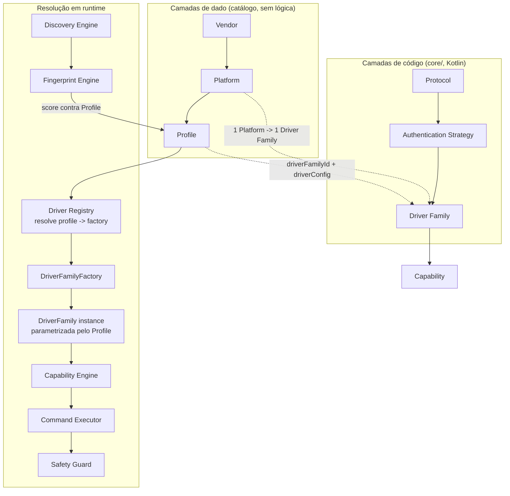

# HAL Layering Model — arquitetura definitiva do NetHAL

> **Status: CONGELADA — aprovada pelo Luiz em 2026-07-06.** Esta é a arquitetura oficial do NetHAL
> a partir de agora. Nenhum código foi alterado para produzir esta análise nem para registrar a
> aprovação — a implementação segue o plano de refatoração do §10, na ordem definida na §11
> ("Decisões do Luiz"), antes de qualquer driver ou modelo novo.

## 0. O que motivou esta revisão

A implementação atual (`TplinkC20OntDriver`, `TplinkOntDriver`, `NokiaOntDriver`) está organizada
por **vendor + modelo**, não por **plataforma tecnológica compartilhada**. Isso funciona com 2-3
drivers; não escala para "centenas de modelos" sem duplicar protocolo/autenticação a cada modelo
novo. Esta revisão avalia a arquitetura real do código hoje (`core/src/main/kotlin/com/nethal/core/`)
e do catálogo (`docs/drivers/compatibility-catalog.md`), e propõe a cadeia de camadas exigida:

```text
Vendor → Platform → Protocol → Authentication Strategy → Driver Family → Profile → Capability
```

---

## 1. Avaliação crítica da arquitetura atual

O NetHAL já acertou o topo e a base da pilha — capability e segurança — e errou o meio: não existe
hoje nenhum conceito que separe "protocolo/autenticação compartilhados" de "modelo específico". O
resultado é que os únicos dois exemplos reais do repositório (TP-Link Archer C6 e Archer C20) já
mostram o problema descrito no pedido: dois drivers no mesmo pacote `driver/tplink/`, nomeados como
se fossem variações do mesmo fabricante, mas que na verdade implementam **dois protocolos totalmente
diferentes**:

| | Archer C6 (`TplinkOntDriver`) | Archer C20 (`TplinkC20OntDriver`) |
|---|---|---|
| Autenticação | Handshake RSA+AES "web encrypted password" (`TplinkAuthenticationClient.kt:56-124`) | HTTP Basic via cookie `Authorization` (`TplinkC20AuthenticationClient.kt:57-132`) |
| Transporte de dados | Múltiplos endpoints `/cgi/getXxx` | Dispatcher único `POST /cgi?1&1&1&8` com blocos de seção em texto plano |
| Sessão | Cookie `JSESSIONID` (hipotético, não confirmado) | Sem sessão de servidor — cookie reenviado a cada chamada |
| Crypto | `TplinkAuthCrypto` (RSA sem padding + AES CBC/GCM) | Nenhuma |

Ou seja: o código **já fez a coisa certa uma vez** (tratar C20 como um mecanismo novo, não forçar no
mesmo handshake do C6) — só não tem onde guardar essa decisão como um conceito de primeira classe.
Hoje essa decisão só existe em prosa (KDoc), nunca em um tipo que o compilador ou o Driver Registry
possam consultar.

---

## 2. Pontos fortes a preservar

- **Vocabulário de capability já é agnóstico de fabricante.** `CapabilityId`/`CapabilityState`
  (`core/model/Capability.kt`) não menciona vendor em lugar nenhum — é exatamente o topo da pilha que
  o modelo-alvo pede. Não precisa mudar.
- **`CompatibilityProfile` já modela quase tudo que "Profile" deveria conter**: vendor, model,
  firmware, capabilities, confidence, evidence, stage (`core/catalog/CompatibilityCatalog.kt:47-69`).
  A estrutura de dados certa já existe — falta só o campo que liga o profile a uma Driver Family.
- **Disciplina de segurança é consistente entre drivers**: guarda de IP privado (RFC 1918) repetida
  em `NokiaOntDriver`, `TplinkOntDriver` e `TplinkC20OntDriver`, credencial nunca retida além da
  chamada de login, `credentialConvention` do catálogo é documental por regra explícita
  (`compatibility-catalog.md:103-107`). Isso não é acidente de cada arquivo — é política do produto
  bem aplicada em cada driver. A refatoração precisa preservar isso centralizado, não just copiá-lo.
- **Driver stage já vive fora do código do driver** (`DriverStage` no catálogo, não hardcoded em
  `TplinkC20OntDriver`). Separação correta entre "estágio de confiança" e "implementação".
- **`FingerprintEngine` já casa evidência contra `CompatibilityProfile`, não contra classe de driver**
  (`fingerprint/FingerprintEngine.kt:67-70`) — o Fingerprint Engine nunca precisou saber que
  driver Kotlin existe, só qual profile bate. Isso já é compatível com a arquitetura-alvo sem
  mudança.

---

## 3. Problemas encontrados

1. **Duplicação estrutural quase literal entre drivers.** `TplinkOntDriver`, `TplinkC20OntDriver` e
   `NokiaOntDriver` repetem, com nomes de enum trocados: `DriverResult` selado
   (Success/Failure), `DriverFailureReason` enum, loop de retry com backoff
   (`repeat(maxAttempts) { ... delay(backoffMillis(attemptIndex)) ... }`), `classifyFailure(Throwable)`
   quase idêntica, e o guard de RFC 1918 no `init {}`. Isso é lógica de **orquestração de driver**
   (retry, classificação de falha, guarda de SSRF), não lógica de protocolo — e está sendo
   reimplementada por modelo em vez de por plataforma.
2. **`TplinkHttpTransport` e `NokiaHttpTransport` são ~90% o mesmo código** (GET/POST via
   `HttpURLConnection`, parsing de `Set-Cookie`, headers). As únicas diferenças reais são timeouts,
   Content-Type padrão e o fato de o Nokia seguir redirects manualmente
   (`NokiaHttpTransport.kt:41-74`) enquanto o TP-Link não. Isso é uma camada de **Protocol** (HTTP
   puro), não deveria existir uma cópia por vendor.
3. **Sem conceito de Platform.** Nada no código expressa "RSA+AES web encrypted password é uma
   plataforma que pode servir dezenas de modelos Archer/Mercusys" — essa afirmação só existe em
   prosa no KDoc (`TplinkAuthenticationClient.kt:32-55`) e em `driver-adoption-strategy.md`. Não é
   consultável por código nem pelo catálogo.
4. **Sem conceito de Authentication Strategy.** O envelope RSA+AES do TP-Link C6
   (`TplinkAuthCrypto.kt`) e o envelope RSA+AES do Nokia (`NokiaAuthenticationClient.kt:60-119`, que
   usa PKCS1 + ISO7816-4 em vez de NoPadding + PKCS5/GCM) são **duas implementações
   independentes da mesma ideia** ("buscar chave pública, cifrar envelope de credencial, extrair
   sessão da resposta"), escritas do zero cada uma. É candidato natural a uma Authentication
   Strategy parametrizável — hoje não existe onde declarar isso.
5. **`profileId` promete uma resolução que não existe em código.** O comentário em
   `DriverRegistry.kt:1-9` e a tabela de `compatibility-catalog.md:59` dizem que `profileId` é
   "usado pelo Driver Registry para resolver o driver correspondente em `drivers/<vendor_family>/`"
   — mas `DriverRegistry` (`core/catalog/DriverRegistry.kt`) só expõe `findProfile(vendor, model)` e
   devolve dados, nunca uma instância de driver. A instanciação real hoje é manual:
   `TplinkC20OntDriver(ip)` direto no `ManualCheckRunnerC20.kt:48` — o catálogo é decorativo nesse
   fluxo, não é consultado para decidir qual driver construir.
6. **Dado de modelo vazando para dentro do código do driver.** `TplinkC20OntDriver.readSnapshot()`
   contém listas de seção/campo hardcoded inline —
   `listOf("LAN_WLAN" to listOf("name", "SSID"))` (`TplinkC20OntDriver.kt:82`) — que são, por
   definição, dado específico de **Profile** (quais seções/campos este modelo exige), não lógica de
   **Driver Family**. Um segundo modelo no mesmo protocolo (ex.: Archer C50 V2, do exemplo do pedido)
   exigiria copiar o arquivo inteiro só para trocar essas litearis.
7. **Colisão de nomenclatura entre "family" do catálogo e "Driver Family" da arquitetura-alvo.** O
   campo `family: String` em `CompatibilityProfile` (`CompatibilityCatalog.kt:52`) documenta
   "descrição textual da família/linha do produto, para contexto humano"
   (`compatibility-catalog.md:63`) — isto é *linha de produto comercial* (ex.: "Archer"), não a
   Driver Family de código proposta aqui. Manter os dois com o mesmo nome vai confundir todo mundo
   (Diego, Bruno, Rafael) assim que a nova camada existir.

---

## 4. Riscos de manter driver por modelo

- **Crescimento combinatório.** N modelos × M protocolos no mesmo vendor duplica lógica de protocolo
  N vezes em vez de M vezes. Com "centenas de modelos" no horizonte, isso é a diferença entre manter
  ~15-20 Driver Families e manter centenas de classes quase idênticas.
- **Bugfix não se propaga.** O changelog do próprio catálogo já documenta um bug de protocolo
  encontrado por diff de HAR byte a byte — `\n` vs `\r\n` no corpo da requisição do C20
  (`compatibility-catalog.md`, ver `TplinkC20AuthenticationClient.kt:44-45`). Hoje esse fix vive em
  um único arquivo de um único modelo. Se amanhã existir `TplinkC50Driver` copiado do C20, o mesmo
  bug de CRLF teria que ser corrigido à mão de novo, sem nenhuma garantia do compilador de que os
  dois lugares foram corrigidos.
- **Onboarding de modelo novo hoje é "copiar um driver existente e renomear"** — exatamente o
  anti-padrão que o pedido quer eliminar, e historicamente a causa mais comum de divergência
  silenciosa entre arquivos irmãos.
- **HARs futuros multiplicariam arquivos 1:1 com modelos** se a forma atual continuar. O requisito
  do pedido ("HARs enriquecem Profile/Capability/Evidence, só excepcionalmente justificam Driver
  Family nova") depende de Driver Family já estar desacoplada de Profile — hoje não está.
- **Custo de teste escala por modelo, não por plataforma.** Cada driver novo reimplementa (e
  reprecisa testar) retry/backoff/classificação de falha, que é comportamento de plataforma, não de
  modelo — visível comparando `TplinkOntDriverTest`, `TplinkC20OntDriverTest`,
  `NokiaOntDriverTest` (mesma forma de teste, três vezes).

---

## 5. Arquitetura HAL recomendada

A ideia central: **duas camadas são dado puro (catálogo, sem lógica), três camadas são código
(Kotlin, sem dado de modelo hardcoded), e uma camada — Protocol — é majoritariamente dado com pouca
lógica de detecção.**

| Camada | Natureza | Onde vive | Contém lógica? |
|---|---|---|---|
| **Vendor** | Dado | Catálogo (string canônica) | Nunca |
| **Platform** | Dado (+ referência) | Catálogo — aponta para 1 Driver Family | Nunca |
| **Protocol** | Dado + heurística de detecção | Catálogo + `fingerprint/` | Pouca (só detecção passiva) |
| **Authentication Strategy** | Código | `core/auth/` | Sim — parametrizável |
| **Driver Family** | Código | `core/driver/family/<vendor>/<família>/` | Sim — toda lógica de comunicação |
| **Profile** | Dado | Catálogo (`CompatibilityProfile`) | Nunca |
| **Capability** | Vocabulário | `core/model/Capability.kt` | Já existe, não muda |

Essa distinção dado/código é o motivo pelo qual "centenas de modelos" fica barato: adicionar um
modelo novo no protocolo já suportado é só **editar o catálogo** (novo Profile apontando pra um
Driver Family existente) — zero Kotlin novo. Só um protocolo/autenticação genuinamente novo pede
código novo.

### 5.1 Vendor

Sem mudança de conceito — string canônica (`"TP-Link"`, `"Nokia"`) já usada em `CompatibilityProfile.
vendor`. Nunca ganha lógica. Não precisa virar enum Kotlin: crescer a lista de vendors deve ser
edição de catálogo, não recompilação do `core`.

### 5.2 Platform (novo)

Registro de dados — não uma classe de comportamento. Um Platform:

- tem um `platformId` estável (`"tplink-legacy-cgi"`, `"tplink-encrypted-web"`, `"nokia-gpon-rsa-aes"`);
- referencia exatamente **um** Driver Family (1:1 — se dois Platforms precisassem do mesmo Driver
  Family, ou são o mesmo Platform, ou o Driver Family está genérico demais);
- documenta quais Protocol(s) usa, para heurística de fingerprint e para o catálogo de
  compatibilidade explicar "por que este profile bate com esta plataforma".

Vive como dado no catálogo (`docs/drivers/compatibility-catalog.md` + JSON), não como classe Kotlin.

### 5.3 Protocol

Já parcialmente existe: `ExpectedProtocolEntry`/`ProtocolDetectionState`
(`CompatibilityCatalog.kt:124-138`) e `DetectedProtocol` (`fingerprint/FingerprintEngine.kt:145-148`).
Recomendo consolidar num enum único `ProtocolId` (HTTP, HTTPS, SOAP, TR064, JSON_RPC, LUCI_RPC,
ROUTEROS_API, CGI_TEXT, REST, WEBSOCKET, SNMP, ...) reutilizado tanto pelo catálogo quanto pelo
Fingerprint Engine — hoje são dois vocabulários paralelos que deveriam ser um só.

### 5.4 Authentication Strategy (novo)

Interface de código, independente de Driver Family:

```kotlin
interface AuthenticationStrategy<TSession> {
    suspend fun login(host: String, transport: HttpTransport, credentials: DriverCredentials): TSession
    fun authenticatedHeaders(session: TSession): Map<String, String>
}
```

Candidatas hoje, pelo que já existe implementado:

- `HttpBasicCookieAuthStrategy` — o mecanismo do C20 (`TplinkC20AuthenticationClient.kt`): não há
  endpoint de login dedicado, a primeira leitura autenticada valida a credencial.
- `RsaAesEnvelopeAuthStrategy` — candidata a generalizar o mecanismo do C6
  (`TplinkAuthCrypto.kt`) e do Nokia (`NokiaAuthenticationClient.kt:60-119`). **Recomendação
  deliberada: não forçar essa unificação agora.** Só existem 2 exemplos, e eles já divergem em
  padding RSA (NoPadding vs PKCS1), padding AES (PKCS5/GCM vs ISO7816-4) e onde a sessão aparece
  (cookie vs header `X-SID`). Generalizar com 2 pontos de dados tende a produzir uma abstração
  errada. Manter as duas implementações concretas por enquanto, mas **como instâncias nomeadas de
  Authentication Strategy**, não como "lógica dentro do driver" — assim que aparecer um terceiro
  exemplo (outro fabricante com handshake RSA+AES), fica óbvio quais parâmetros realmente variam e
  a generalização vira segura.

### 5.5 Driver Family

Toda a lógica de comunicação. Um Driver Family recebe um `CompatibilityProfile` (dado) como
configuração, nunca tem endpoint/campo de modelo hardcoded:

```kotlin
interface DriverFamily {
    suspend fun readCapability(id: CapabilityId): CapabilityReadResult
    // write, quando aplicável, entra no mesmo desenho, gateado pelo Safety Guard
}

interface DriverFamilyFactory {
    val familyId: DriverFamilyId
    fun create(profile: CompatibilityProfile, host: String, transport: HttpTransport): DriverFamily
}
```

Mapeamento dos drivers atuais para famílias (usando os nomes de exemplo do próprio pedido):

- `TpLinkLegacyCgiDriver` ← `TplinkC20OntDriver` + `TplinkC20AuthenticationClient` +
  `TplinkC20ResponseParser`. Serve C20 hoje; serviria Archer C50 V2 amanhã (exemplo do pedido) só
  trocando o Profile.
- `TpLinkEncryptedWebDriver` ← `TplinkOntDriver` + `TplinkAuthenticationClient` + `TplinkAuthCrypto`
  + `TplinkResponseParser`. Serve C6 hoje; serviria qualquer Archer/Mercusys com o mesmo handshake
  "web encrypted password" (a pesquisa em `driver-adoption-strategy.md` já indica que isso é comum
  na linha).
- `NokiaOntGponDriver` ← `NokiaOntDriver` + `NokiaAuthenticationClient` + `NokiaAuthCrypto` +
  `NokiaResponseParser`. Serve G-1425G-B hoje; serviria outras ONTs Nokia GPON da mesma base de
  firmware.

Retry/backoff/classificação de falha/guarda RFC 1918 saem dos três drivers e viram um componente
único reutilizado por qualquer Driver Family (`core/driver/DriverRetryPolicy.kt` +
`core/discovery/PrivateIpRanges` já centralizado, só falta o retry).

Transporte HTTP (`TplinkHttpTransport`/`NokiaHttpTransport`) vira um único `HttpTransport` em
`core/protocol/http/`, parametrizado por timeouts/redirects/headers default — elimina a segunda
duplicação quase literal encontrada.

### 5.6 Profile

Já é `CompatibilityProfile`. Mudanças necessárias (ver §6 do pedido, "Compatibility Catalog",
detalhado na seção 9 abaixo):

- adicionar `platformId: String` (novo, obrigatório);
- adicionar `driverFamilyId: String` (novo, obrigatório — é a chave que o Driver Registry usa para
  resolver a classe);
- adicionar `driverConfig: JsonElement` (novo, opaco — carrega o que hoje está hardcoded dentro do
  driver Kotlin: bundle de seções/campos do C20, mapeamento de endpoints do C6/Nokia). Cada Driver
  Family interpreta seu próprio formato de `driverConfig`; o catálogo não impõe um schema único
  entre protocolos diferentes;
- renomear o campo `family` existente (linha de produto comercial, ex. "Archer") para algo como
  `productLine`, para não colidir com o novo `driverFamilyId`.

### 5.7 Capability

Sem mudança. `CapabilityId`/`CapabilityState` já é o vocabulário certo e já é consumido de forma
agnóstica de vendor pelo catálogo e (presumivelmente) pelo Capability Engine ainda não implementado.

---

## 6. Diagrama completo da arquitetura



---

## 7. Estrutura de diretórios sugerida

```text
core/src/main/kotlin/com/nethal/core/
  model/
    Capability.kt                       # inalterado
    DeviceInfo.kt, WifiStatus.kt, ...    # inalterado

  catalog/
    CompatibilityCatalog.kt             # + platformId, driverFamilyId, driverConfig; family -> productLine
    DriverRegistry.kt                   # inalterado no papel (dado de profile)
    DriverFamilyRegistry.kt             # NOVO: profileId -> DriverFamily via factory registrada

  protocol/
    ProtocolId.kt                       # NOVO: enum único, substitui vocabulário duplicado hoje
    http/
      HttpTransport.kt                  # NOVO: unifica TplinkHttpTransport + NokiaHttpTransport

  auth/
    AuthenticationStrategy.kt           # NOVO: interface
    HttpBasicCookieAuthStrategy.kt      # NOVO: generaliza TplinkC20AuthenticationClient
    strategy/
      TpLinkEncryptedWebAuth.kt         # migrado de TplinkAuthCrypto + TplinkAuthenticationClient
      NokiaRsaAesAuth.kt                # migrado de NokiaAuthCrypto + NokiaAuthenticationClient
      # (sem unificar os dois RSA+AES ainda — ver §5.4)

  driver/
    DriverRetryPolicy.kt                # NOVO: retry/backoff/classifyFailure compartilhado
    family/
      tplink/
        legacycgi/                     # era driver/tplink/*C20*
          TpLinkLegacyCgiDriverFamily.kt
          TpLinkLegacyCgiResponseParser.kt   # ex-TplinkC20ResponseParser
        encryptedweb/                   # era driver/tplink/Tplink*(sem C20)
          TpLinkEncryptedWebDriverFamily.kt
          TpLinkEncryptedWebResponseParser.kt # ex-TplinkResponseParser
      nokia/
        ontgpon/
          NokiaOntGponDriverFamily.kt
          NokiaResponseParser.kt

  tooling/
    ManualCheckRunner.kt                 # NOVO: um runner genérico parametrizado por driverFamilyId
                                          # + profileId, substitui os `main()` quase idênticos de
                                          # ManualCheckRunner.kt / ManualCheckRunnerC20.kt
```

---

## 8. Fluxo completo: Discovery → Driver Registry → Profile → Capability

1. **Discovery Engine** encontra candidatos de rede (`DiscoveryEngine.kt`) — inalterado.
2. **Fingerprint Engine** casa evidência passiva contra `Profile`s do catálogo, devolve
   `matchedProfileId` + confidence — inalterado (`FingerprintEngine.kt:61-88`), porque já opera no
   nível de Profile, não de classe de driver.
3. **Driver Registry** (dado) devolve o `CompatibilityProfile` completo para o `profileId` casado —
   inalterado no papel.
4. **Driver Family Registry** (novo) recebe esse `CompatibilityProfile`, lê `profile.driverFamilyId`,
   encontra a `DriverFamilyFactory` registrada para esse id (mapa fixo, montado uma vez na
   inicialização do `core` — não é reflection nem scan dinâmico) e constrói a `DriverFamily`
   passando `profile.driverConfig` como configuração.
5. **Capability Engine** (ainda não implementado no código, só na spec §8.6) consulta
   `profile.capabilities[]` para saber quais `CapabilityId` declarar como `AVAILABLE`/
   `EXPERIMENTAL`/etc., e delega leitura real para a `DriverFamily` instanciada — nunca pergunta
   "é TP-Link?", sempre "este profile declara `READ_WIFI_STATUS`?".

   **Atualização 2026-07-08 (issue #16)**: a metade "sessão" deste passo está implementada —
   `core/capability/CapabilityEngine.kt` autentica de forma lazy contra uma `DriverFamily` já
   resolvida, reaproveita a sessão entre leituras e renova automaticamente em caso de expiração
   (`CapabilityReadResult.SessionExpired`), ver KDoc da classe para a decisão de arquitetura
   completa. A metade "consultar `profile.capabilities[]` do catálogo para declarar estado inicial
   por capability" **continua fora de escopo** — o `CapabilityEngine` de hoje só decide sessão
   (autenticado ou não) e repassa o resultado de `DriverFamily.readCapability(id)` como está; ele
   não olha o catálogo. Primeiro uso real: `TpLinkStokLuciDriverFamily` (`READ_WIFI_STATUS`,
   `READ_LAN_STATUS`, `READ_WAN_STATUS`, `READ_CONNECTED_CLIENTS`).
6. **Command Executor** e **Safety Guard** operam sobre `CapabilityId`, nunca sabem qual Driver
   Family está por trás — sem mudança de desenho, só reforça que a fronteira certa já estava correta
   nessas duas camadas superiores.

Nenhum componente entre o passo 5 e 6 precisa saber que existem "TP-Link" ou "Nokia" — a
identidade do fabricante para de existir como decisão de código a partir do momento em que o
Profile é resolvido.

---

## 9. Estratégia de evolução para centenas de modelos sem duplicação

Regra de decisão para qualquer HAR novo (dá o critério objetivo que o pedido exige):

| O que o HAR mostra | Ação |
|---|---|
| Vendor/modelo/firmware novo, mesmo protocolo/auth já coberto por uma Driver Family existente | **Novo Profile só de dado.** Zero Kotlin. Exemplo do próprio pedido: Archer C20 V1 e Archer C50 V2 viram dois Profiles apontando para `TpLinkLegacyCgiDriver`. |
| Mesmo Profile, campo/seção/endpoint adicional descoberto, confiança mudou | **Enriquece o Profile existente** (`fingerprintEvidence[]`, `capabilities[]`, `confidenceScoreOverall`, `driverConfig`) — igual ao que já acontece hoje nos changelogs de `compatibility-catalog.md`. |
| Mecanismo de autenticação ou envelope de protocolo que nenhuma Authentication Strategy/Driver Family registrada consegue expressar mesmo variando `driverConfig` | **Só aqui** se justifica Driver Family nova — e, como no critério de promoção de estágio, isso pede aprovação explícita do Rafael (mesmo gate de `/ciclo-vida-driver`, estendido a "Driver Family nova" além de "mudança de estágio"). |

Isso é literalmente o que já aconteceu com C20: o HAR mostrou um dispatcher único com Basic Auth via
cookie, que nenhuma Authentication Strategy existente (RSA+AES do C6) conseguia expressar — criar um
mecanismo novo foi a decisão certa. O problema não foi criar `TplinkC20AuthenticationClient`; foi
não ter um lugar (Driver Family + registro) para declarar "isso é uma plataforma nova", o que fez a
decisão parecer "mais um driver por modelo" em vez de "uma Driver Family nova, reaproveitável por
dezenas de modelos futuros".

Consequência prática para volume: com essa regra, **centenas de HARs devem produzir dezenas de
Driver Families no máximo** (uma por combinação real de protocolo+autenticação encontrada), e
centenas de Profiles (dado puro, edição de catálogo, sem review de código Kotlin nem Marisa
precisar revisar segurança de novo — só Diego valida evidência, exatamente como hoje).

---

## 9.1 Caso real — TP-Link Archer C6 com duas plataformas por firmware

Em 2026-07-07, teste real contra a unidade física de teste do Luiz (TP-Link Archer C6, recém
resetada de fábrica, IP `192.168.0.1`) validou em produção, não só em teoria, exatamente o problema
que motivou este documento inteiro: **o mesmo vendor + modelo comercial pode ter duas plataformas
genuinamente diferentes conforme a geração de firmware.**

O driver/profile existente (`tplink_archer_c6_v1`, mecanismo "web encrypted password": RSA sem
padding + AES via `POST /cgi/getParm` + `POST /cgi_gdpr`, implementado em `TplinkOntDriver`/
`TplinkAuthenticationClient`) falhou contra a unidade real: `POST /cgi/getParm` devolveu HTTP
404 — o endpoint simplesmente não existe nesse firmware. Não foi um bug de driver nem de rede;
probes passivos reais subsequentes (sem credencial) mostraram que a unidade roda um mecanismo de
login inteiramente diferente:

- `GET /` → redireciona (meta-refresh) para `/webpages/login.html`.
- `/webpages/login.html` carrega scripts próprios de cifra client-side (`tpEncrypt.js`,
  `cryptoJS.min.js`) — não a lib `TplinkAuthCrypto` que o driver atual usa.
- Os quatro formulários de login encontrados (`form-first-login`, `form-login`, `form-login-bind`,
  `form-forget-password`) têm todos `action="/cgi-bin/luci"` e **nenhum campo de usuário** — só
  senha. Modelo de credencial diferente do mecanismo antigo (usuário + senha).

Pesquisa comunitária complementar (`tplinkrouterc6u`/`home-assistant-tplink-router`, sucessor do
`AlexandrErohin/TP-Link-Archer-C6U` já citado em `driver-adoption-strategy.md`) confirma que isso
não é uma configuração isolada: o pacote documenta explicitamente **duas gerações de mecanismo de
login para o mesmo hardware Archer C6/C6U** — a antiga ("Web Encrypted Password") e uma nova via
`POST /cgi-bin/luci/;stok=/login?form=login` (token `stok` + cookie `sysauth`), com uma issue aberta
no repositório afirmando que "firmwares mais novos não suportam mais Web Encrypted Password". É
migração deliberada de plataforma pela TP-Link entre gerações de firmware, não capricho de uma
unidade específica.

**Resultado no catálogo** (`catalog-2026.07.14.json`, ver changelog completo em
`docs/drivers/compatibility-catalog.md`): dois profiles distintos para o mesmo vendor+modelo
comercial, exatamente como a arquitetura de §5.2/§5.6 prevê —

| | `tplink_archer_c6_v1` (existente) | `tplink_archer_c6_stok_v1` (novo) |
|---|---|---|
| `platformId` | `tplink-encrypted-web` | `tplink-stok-luci` |
| `driverFamilyId` | `tplink-encrypted-web-driver` | `tplink-stok-luci-driver` (ainda sem `DriverFamily` implementada) |
| `stage` | `DRAFT` (evidência negativa registrada, não promovido) | `DISCOVERY_ONLY` (contato de rede real documentado, sem autenticação) |
| Evidência desta rodada | Nova entrada `REFUTED` em `fingerprintEvidence[]` (`POST /cgi/getParm` → HTTP 404) | Toda a evidência de discovery passivo real (headers, estrutura de menu, mecanismo de auth) |

Isso confirma em produção real a regra de decisão da tabela §9: um HAR/probe que mostra um
mecanismo de autenticação que nenhuma Authentication Strategy/Driver Family existente consegue
expressar justifica **Profile novo com Platform/Driver Family própria**, nunca forçar o dado no
mesmo Profile só porque o vendor/modelo comercial é idêntico. Sem a camada Platform separada do
Profile "TP-Link Archer C6", este caso teria virado uma mistura confusa de campos condicionais
dentro de um único profile, ou pior, teria sido tratado como "bug" do profile existente em vez de
"plataforma nova".

### Gap corrigido — `DriverRegistry.findProfile(vendor, model)` era ambíguo com dois profiles

`DriverRegistry.findProfile(vendor, model)` (`core/src/main/kotlin/com/nethal/core/catalog/
DriverRegistry.kt`) resolvia com `currentManifest.profiles.firstOrNull { vendor+model match }` —
assumia implicitamente **um único profile por combinação vendor+modelo**. Com dois profiles reais
TP-Link/Archer C6 no catálogo, essa função era genuinamente ambígua: sempre devolvia
`tplink_archer_c6_v1` (primeiro no array), mesmo quando a unidade física do usuário roda a
plataforma `tplink-stok-luci`.

O `FingerprintEngine` automático (`core/src/main/kotlin/com/nethal/core/fingerprint/
FingerprintEngine.kt`) **nunca teve esse problema**: ele pontua todos os profiles do catálogo contra
a evidência coletada (§5.3/§8 passo 2) e escolhe pelo score, nunca busca por vendor+modelo — os dois
profiles TP-Link C6 competem normalmente pela evidência real (o `stok`/luci deve pontuar mais alto
contra uma unidade que exiba a estrutura `/webpages/login.html` + `/cgi-bin/luci`, o `encrypted-web`
deve pontuar mais alto contra uma unidade que responda em `/cgi/getParm`).

**Correção aplicada:** `DriverRegistry` ganhou `findProfiles(vendor, model): List<CompatibilityProfile>`,
que devolve todos os profiles que casam com vendor+modelo (hoje, os dois profiles TP-Link/Archer C6).
`findProfile` (singular) continua existindo — nenhum código de produção real dependia dele no caso
ambíguo, o único uso fora de teste era `ManualCheckRunner` (ferramenta CLI de teste manual) contra
`Archer C20`, que só tem um profile no catálogo — mas passou a ser documentado explicitamente como
atalho que "escolhe o primeiro quando há ambiguidade, sem resolver o conflito"; qualquer chamador que
precise decidir entre profiles concorrentes deve usar `findProfiles`. A Tela 3 (identificação manual,
spec §11) segue sem implementação de UI no `app` — quando for implementada, deve consumir
`findProfiles` e apresentar a escolha ao usuário quando houver mais de um match.

Teste de regressão: `DriverRegistryTest` (`core/src/test/kotlin/com/nethal/core/catalog/
DriverRegistryTest.kt`) — `findProfiles returns every profile that matches vendor and model,
including ambiguous TP-Link Archer C6 case`.

---

## 10. Plano de refatoração (preservando o máximo do código existente)

Nenhuma etapa abaixo deve começar antes deste documento ser aprovado. Ordem sugerida, cada uma um PR
pequeno/médio independente:

1. **Extrair `HttpTransport` compartilhado** a partir de `TplinkHttpTransport` +
   `NokiaHttpTransport` (parametrizado por timeouts/redirects/Content-Type default). Puramente
   mecânico, zero mudança de protocolo, menor risco de toda a lista — bom primeiro PR.
2. **Extrair `DriverRetryPolicy`** a partir do `repeat(maxAttempts) { ... }` triplicado em
   `TplinkOntDriver`/`TplinkC20OntDriver`/`NokiaOntDriver`. Preserva os testes existentes de retry
   (só move onde a lógica mora).
3. **Introduzir `AuthenticationStrategy` como interface**, movendo `TplinkAuthCrypto` +
   `TplinkAuthenticationClient`, `TplinkC20AuthenticationClient` e `NokiaAuthenticationClient` para
   implementá-la — sem generalizar os dois RSA+AES ainda (§5.4). Testes existentes
   (`TplinkAuthenticationClientTest`, `NokiaAuthenticationClientTest`, etc.) continuam válidos, só
   testam contra a interface.
4. **Introduzir `DriverFamily`/`DriverFamilyFactory`**, renomeando (não reescrevendo)
   `TplinkC20OntDriver` → `TpLinkLegacyCgiDriverFamily`, `TplinkOntDriver` →
   `TpLinkEncryptedWebDriverFamily`, `NokiaOntDriver` → `NokiaOntGponDriverFamily`. Mover os literais
   de seção/campo hardcoded (ex.: `TplinkC20OntDriver.kt:82-88`) para fora do driver, recebidos via
   `profile.driverConfig`.
5. **Estender `CompatibilityProfile`**: `platformId`, `driverFamilyId`, `driverConfig`, renomear
   `family` → `productLine`. Migrar os dois manifestos existentes (`catalog-2026.07.09.json`) com os
   novos campos preenchidos para os profiles Nokia/TP-Link C6 já existentes, e criar o profile do
   C20 que hoje só existe como driver, sem entrada no catálogo ainda.
6. **Implementar `DriverFamilyRegistry`** (mapa fixo `driverFamilyId -> DriverFamilyFactory`,
   montado na inicialização do `core`) e ligar ao `DriverRegistry` existente — fecha o fluxo descrito
   em §8, substituindo a construção manual em `ManualCheckRunnerC20.kt:48`.
7. **Consolidar os `ManualCheckRunner.kt`/`ManualCheckRunnerC20.kt`** num único runner parametrizado
   por `driverFamilyId` + `profileId`, eliminando a terceira duplicação (menor prioridade, é
   ferramenta de diagnóstico manual, não código de produto).
8. **Atualizar documentação**: `docs/drivers/driver-model.md`, `docs/drivers/compatibility-catalog.md`,
   `docs/architecture/overview.md` e `CONTRIBUTING.md` passam a descrever a cadeia de 7 camadas como
   modelo oficial, substituindo a estrutura `drivers/tplink_archer/` (uma pasta por vendor+família
   comercial) sugerida em `specification.md` §8.5 pela estrutura de §7 deste documento.

Cada etapa preserva os testes unitários existentes (fakes de transporte, casos de sucesso/falha já
cobertos) — a refatoração move e renomeia comportamento validado, não reescreve do zero.

---

---

## 10.1 Composition Root + App Integration (concluído em 2026-07-10)

O passo formal 8 acima é "Atualizar documentação". Este passo 10.1 documenta o trabalho de integração
que complementou a arquitetura proposta no §10:

**Concluído nesta rodada:**
- **Composition Root:** `core/src/main/kotlin/com/nethal/core/driver/family/DriverFamilies.kt` —
  centraliza o mapa fixo `driverFamilyId -> DriverFamilyFactory` (estático, não via reflection),
  montado uma única vez na inicialização do `core`. Vive em `core`, não em `app`, conforme decisão
  explícita do Luiz em 2026-07-06 — quando app/Capability Engine reais precisarem, pode ser exposto
  como API pública do `core` consumida pelo `app`.
- **Driver Families produção:** Implementadas e registradas no composition root:
  - `TpLinkLegacyCgiDriverFamily` — TP-Link Archer C20, dispatcher `/cgi?1&1&1&8` + HTTP Basic auth
  - `TpLinkStokLuciDriverFamily` — TP-Link Archer C6, protocolo `/cgi-bin/luci` + token `stok`
  - `NokiaGponDriverFamily` — Nokia G-1425G-B, RSA+AES + GPON
  - `TpLinkGdprCgiDriverFamily` e `TpLinkXdrDsDriverFamily` — experimental, parser sem hardware confirmado
- **Capability Engine:** `core/src/main/kotlin/com/nethal/core/capability/CapabilityEngine.kt` —
  autentica de forma lazy contra uma `DriverFamily` resolvida, reaproveita sessão entre leituras,
  renova em caso de expiração (`CapabilityReadResult.SessionExpired`).
- **Telas do NetHAL Lab (app):** Telas 1-6 implementadas com Jetpack Compose, consumindo Driver Family
  real via Capability Engine:
  - Tela 1: Discovery (List)
  - Tela 2: Device Detail
  - Tela 4: Capabilities
  - Tela 5: Autenticação
  - Tela 6: Relatório
- **Testes:** 235+ cenários de teste, discovery e capability engine validados contra hardware real.

**Decisão de arquitetura (2026-07-06):** Composition root permanece em `core` com API pública consumida
pelo `app`, nunca migrado para `app` nesta rodada. Possível revisão futura se Capability Engine migrar
para `app` como consumidor primário — por enquanto, é componente do `core` que o `app` consome via
injeção de dependências.
---

## 10.1 Composition Root + App Integration (concluído em 2026-07-10)

O passo formal 8 acima é "Atualizar documentação". Este passo 10.1 documenta o trabalho de integração
que complementou a arquitetura proposta no §10:

**Concluído nesta rodada:**
- **Composition Root:** `core/src/main/kotlin/com/nethal/core/driver/family/DriverFamilies.kt` —
  centraliza o mapa fixo `driverFamilyId -> DriverFamilyFactory` (estático, não via reflection),
  montado uma única vez na inicialização do `core`. Vive em `core`, não em `app`, conforme decisão
  explícita do Luiz em 2026-07-06 — quando app/Capability Engine reais precisarem, pode ser exposto
  como API pública do `core` consumida pelo `app`.
- **Driver Families produção:** Implementadas e registradas no composition root:
  - `TpLinkLegacyCgiDriverFamily` — TP-Link Archer C20, dispatcher `/cgi?1&1&1&8` + HTTP Basic auth
  - `TpLinkStokLuciDriverFamily` — TP-Link Archer C6, protocolo `/cgi-bin/luci` + token `stok`
  - `NokiaGponDriverFamily` — Nokia G-1425G-B, RSA+AES + GPON
  - `TpLinkGdprCgiDriverFamily` e `TpLinkXdrDsDriverFamily` — experimental, parser sem hardware confirmado
- **Capability Engine:** `core/src/main/kotlin/com/nethal/core/capability/CapabilityEngine.kt` —
  autentica de forma lazy contra uma `DriverFamily` resolvida, reaproveita sessão entre leituras,
  renova em caso de expiração (`CapabilityReadResult.SessionExpired`).
- **Telas do NetHAL Lab (app):** Telas 1-6 implementadas com Jetpack Compose, consumindo Driver Family
  real via Capability Engine:
  - Tela 1: Discovery (List)
  - Tela 2: Device Detail
  - Tela 4: Capabilities
  - Tela 5: Autenticação
  - Tela 6: Relatório
- **Testes:** 235+ cenários de teste, discovery e capability engine validados contra hardware real.

**Decisão de arquitetura (2026-07-06):** Composition root permanece em `core` com API pública consumida
pelo `app`, nunca migrado para `app` nesta rodada. Possível revisão futura se Capability Engine migrar
para `app` como consumidor primário — por enquanto, é componente do `core` que o `app` consome via
injeção de dependências.
## 11. Decisões do Luiz (2026-07-06)

1. **Platform fica só como metadado de catálogo, não vira tipo Kotlin agora.** Confirma a
   recomendação do §5.2 — sem abstração prematura. Promoção a tipo próprio só se admin/telemetria
   passarem a precisar de query rica por Platform; até lá é string simples.

   Os identificadores suficientes no `CompatibilityProfile`, por decisão explícita, são:

   ```text
   vendor          (já existe — string canônica, não precisa virar "vendorId" nem tipo novo)
   platformId      (novo — string)
   driverFamilyId  (novo — string, chave de resolução no Driver Family Registry)
   profileId       (já existe)
   ```

   Nenhum Vendor/Platform Kotlin type é criado nesta rodada. `driverConfig` (§5.6) continua
   necessário para tirar dado de modelo hardcoded do driver, mas seu schema fica deliberadamente
   opaco por Driver Family — não é um identificador, é o payload de configuração, e não faz parte
   desta lista mínima.

2. **RSA+AES do TP-Link C6 e do Nokia continuam implementações separadas.** Regra explícita do
   Luiz: **primeiro evidência, depois abstração** — os dois "parecem" o mesmo mecanismo por usarem
   RSA+AES, mas já divergem em padding RSA, padding AES, onde a sessão aparece e tratamento de erro
   (§5.4); diferenças de handshake/payload/lifecycle ainda não mapeadas também podem existir. Só
   extrair uma `AuthenticationStrategy` comum quando: (a) aparecer um terceiro caso real do mesmo
   padrão, ou (b) a duplicação entre os dois existentes ficar comprovada e estável — nunca a partir
   de só dois pontos de dados. Este princípio ("primeiro evidência, depois abstração") vale como
   critério geral para qualquer futura tentativa de unificar Driver Families ou Authentication
   Strategies, não só para este par.

3. **A refatoração do §10 roda inteira antes de qualquer driver ou modelo novo.** Ordem obrigatória:

   1. Fundação primeiro — `HttpTransport`, `DriverRetryPolicy`, `AuthenticationStrategy` (mantendo
      C6 e Nokia separados, decisão 2 acima), `CompatibilityProfile` estendido, `DriverFamilyRegistry`
      (passos 1, 2, 3, 5, 6 do §10).
   2. **Só depois**, reorganizar o C20 como `TpLinkLegacyCgiDriverFamily` + Profile
      `tplink_archer_c20_v1` (passo 4 do §10) — o C20 é o **caso de validação da arquitetura**, não
      pode ser promovido de estágio de forma acoplada a "mais um modelo": a reorganização dele prova
      que a arquitetura funciona antes de qualquer expansão.
   3. **Só depois disso**, retomar captura completa de novas capabilities do C20 ou qualquer driver
      além dele.

   Nenhuma expansão de cobertura (novo modelo, nova capability, novo fabricante) começa antes do
   passo 1 estar concluído. O NetHAL não deve virar "coleção de drivers por modelo" — a prioridade
   imediata é estabilizar a fundação da HAL, não ganhar cobertura.
